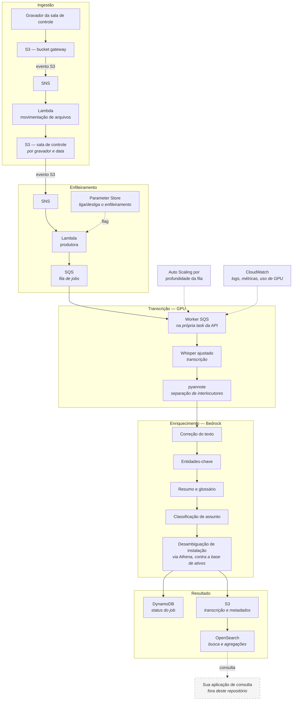

# ONS Transcribe — pipeline de transcrição de áudio operativo

Pipeline que transcreve e enriquece gravações de comunicação operativa do setor elétrico.
Um Whisper ajustado ao domínio faz a transcrição, o pyannote separa os interlocutores, e
um LLM no AWS Bedrock corrige o texto, extrai entidades, resume, gera glossário e
classifica o assunto. O resultado é indexado no OpenSearch, pesquisável.

[](LICENSE)

Desenvolvido pelo **ONS** (Operador Nacional do Sistema Elétrico) e mantido pela
Comunidade de IA do ONS.

## Índice

- [O problema](#o-problema)
- [Como funciona](#como-funciona)
- [O que está e o que não está neste repositório](#o-que-está-e-o-que-não-está-neste-repositório)
- [Estrutura](#estrutura)
- [Stack](#stack)
- [Pré-requisitos](#pré-requisitos)
- [Instalação e configuração](#instalação-e-configuração)
- [Configuração sensível](#configuração-sensível)
- [Deploy da infraestrutura](#deploy-da-infraestrutura)
- [Usando a API](#usando-a-api)
- [Modelos de machine learning](#modelos-de-machine-learning)
- [Testes](#testes)
- [Avaliação de qualidade](#avaliação-de-qualidade)
- [Documentação](#documentação)
- [Contribuindo](#contribuindo)
- [Licença](#licença)

## O problema

A operação do sistema elétrico acontece por telefone. Centros de operação e agentes
trocam, todos os dias, milhares de chamadas curtas que coordenam manobras, alteram
programas de geração, comunicam anormalidades e autorizam retorno de equipamento. Essas
chamadas são gravadas por obrigação regulatória.

O acervo resultante é grande e, na prática, inconsultável: para achar uma conversa é
preciso saber de antemão a data, o gravador e o ramal, e depois ouvir o áudio inteiro.

Este pipeline transforma esse acervo em texto pesquisável e estruturado. Além da
transcrição, cada áudio recebe:

- **texto corrigido** para a terminologia do setor — siglas em caixa alta, unidades
  padronizadas, horários normalizados
- **entidades-chave**: operadores envolvidos, agente, instalação ou usina, equipamento,
  número do registro de ocorrência
- **resumo** da conversa
- **glossário** dos termos técnicos que apareceram
- **classificação de assunto** entre as categorias da operação
- **desambiguação de instalação** contra a base oficial de ativos, para que o mesmo ativo
  não apareça sob dezenas de grafias diferentes

## Como funciona



Pontos de projeto que valem destacar:

- **O worker é desacoplado e roda dentro da task da API.** Ele consome a fila SQS e
  transcreve em sequência. Não há Lambda intermediária de transcrição: ela existia e foi
  removida porque competia com o worker pela GPU.
- **A transcrição é sequencial por decisão.** A GPU é o recurso escasso; paralelizar
  segmentos aumentava o pico de VRAM e causava `CUDA OOM`. O paralelismo se dá
  horizontalmente, por instância.
- **O escalonamento observa a profundidade da fila**, não a CPU — o sinal que corresponde
  ao trabalho pendente de verdade.
- **O enfileiramento tem um interruptor** em Parameter Store, para pausar o custo de GPU
  sem desmontar a infraestrutura.
- **O modelo de LLM é resolvido por etapa**, em tempo de execução, via Parameter Store.
  Trocar o modelo do resumo não exige deploy.

## O que está e o que não está neste repositório

**Está:** todo o mecanismo de transcrição — a API Python que serve os modelos, o worker
que consome a fila, as funções Lambda de ingestão e indexação, a infraestrutura completa
em Terraform, os notebooks de ajuste dos modelos e o instrumental de avaliação de
qualidade.

**Não está:** a camada de consulta. O sistema de origem tinha uma API REST em .NET e uma
interface em SharePoint que liam o índice do OpenSearch; ambas ficaram fora, porque são
específicas do ambiente corporativo de origem e não fazem parte do mecanismo de
transcrição.

Em termos práticos: **o pipeline entrega no OpenSearch, e a consulta é sua.** O índice
resultante é um documento por áudio, com a transcrição, os campos enriquecidos e os
metadados — pesquisável por qualquer cliente Elasticsearch/OpenSearch. O formato do
documento está em `ONSTranscribe/api/app/examples/sample_response.json`.

## Estrutura

```
ONSTranscribe/
  api/
    app/                      FastAPI, worker SQS, serviços de ML e LLM
      api/v1/                 rotas
      services/               transcrição, diarização, LLM, métricas de GPU
      utils/                  correções de texto, logging
      examples/               exemplos de requisição e resposta
    terraform/                infraestrutura completa
      ingestao_gateway.tf     1º estágio: chegada do áudio e movimentação
      sns.tf, sqs.tf          2º estágio: enfileiramento
      ecs.tf, capacity_provider.tf, autoscaling.tf    execução com GPU
      prompts.tf, prompts/    prompts do Bedrock, externalizados
      installations.tf        desambiguação de instalação via Athena
      metricas_transcricao/   módulo de métricas de qualidade
      lambdas/                funções de apoio e layers
    tests/                    testes do worker, OOM, timeout, custo de LLM
  finetuning/                 ajuste dos três modelos
  scripts/                    esteira de montagem de ambiente
```

## Stack

| Camada | Tecnologia |
|---|---|
| API e worker | Python 3.12, FastAPI, Uvicorn, Pydantic, [Astral UV](https://docs.astral.sh/uv/) |
| Transcrição | Whisper Medium ajustado ao domínio (`transformers`, `torch` com CUDA) |
| Separação de interlocutores | `pyannote.audio` |
| Enriquecimento | AWS Bedrock, com modelo configurável por etapa |
| Busca | OpenSearch |
| Estado dos jobs | DynamoDB |
| Armazenamento | S3 |
| Mensageria | SQS, SNS |
| Computação | ECS sobre EC2 com GPU NVIDIA T4, Lambda |
| Base de ativos | Athena / Glue |
| Configuração | Systems Manager Parameter Store |
| Observabilidade | CloudWatch |
| Infraestrutura como código | Terraform |

## Pré-requisitos

- Python 3.12 — o projeto fixa `>=3.12,<3.13`
- [Astral UV](https://docs.astral.sh/uv/)
- Terraform 1.5 ou superior
- Docker, para construir a imagem do container
- Conta AWS com permissão para criar os recursos, e AWS CLI configurado
- Acesso ao AWS Bedrock, com os modelos habilitados na região
- Para rodar com aceleração: GPU NVIDIA com CUDA. Sem GPU o serviço funciona, mas a
  transcrição fica lenta.
- Conta no Hugging Face com token — o pyannote exige aceite de termos no Hub

## Instalação e configuração

```bash
git clone https://github.com/ONSBR/TIAGO-Transcricao.git
cd TIAGO-Transcricao/ONSTranscribe/api
uv sync
source .venv/bin/activate
```

Crie o `.env` a partir das variáveis abaixo. Os valores são exemplos.

```bash
# Acesso à AWS
AWS_PROFILE=default
AWS_DEFAULT_REGION=us-east-1

# Buckets
BUCKET_NAME=exemplo-audio-bucket
TRANSCRIBE_S3_NAME=exemplo-audio-bucket

# Caminhos dos modelos no S3
TRANSCRIBE_S3_MODEL_PATH="models/whisper_finetune/"
TRANSCRIBE_S3_SEGMENTATION_MODEL_PATH="models/segmentation_finetuned/"

# Modelo de LLM de referência (pode ser sobreposto por etapa via Parameter Store)
TRANSCRIBE_BEDROCK_MODEL="<id-do-modelo-no-bedrock>"

# IDs e versões dos prompts provisionados pelo Terraform
RUN_BEAUTIFY_PROMPT_ID=<id>
RUN_BEAUTIFY_PROMPT_VERSION=DRAFT
RUN_BEAUTIFY_SYSTEM_PROMPT_ID=<id>
RUN_BEAUTIFY_SYSTEM_PROMPT_VERSION=DRAFT
KEY_ENTITIES_PROMPT_ID=<id>
KEY_ENTITIES_PROMPT_VERSION=DRAFT
SUMMARY_PROMPT_ID=<id>
SUMMARY_PROMPT_VERSION=DRAFT
GLOSSARY_PROMPT_ID=<id>
GLOSSARY_PROMPT_VERSION=DRAFT
SUBJECT_PROMPT_ID=<id>
SUBJECT_PROMPT_VERSION=DRAFT

PYTHONPATH=$(pwd)
```

Os IDs de prompt são gerados quando o Terraform cria os recursos de prompt no Bedrock —
pegue-os nos outputs depois do primeiro apply.

```bash
set -a && source .env && set +a
uvicorn app.main:app --reload
```

Ajustes de execução, todos opcionais, com padrão conservador no código:

| Variável | Padrão | Efeito |
|---|---|---|
| `MAX_TRANSCRIBE_WORKERS` | 1 | Segmentos transcritos em paralelo. Acima de 1 aumenta o pico de VRAM. |
| `DIARIZATION_BATCH_SIZE` | 8 | Lote da separação de interlocutores. O padrão do pyannote (32) estoura a VRAM sob carga. |
| `JOB_TIMEOUT_S` | 900 | Tempo máximo de um job antes de abortar internamente. |

**Credenciais AWS.** A aplicação não usa access key. Os clientes AWS são construídos sem
credencial explícita, deixando o SDK resolver pela cadeia padrão: em ECS isso aponta para
a IAM role da task; na sua máquina, para o perfil ou as variáveis de ambiente locais.

## Configuração sensível

O repositório é público. Nenhum valor real de ambiente é versionado, e o padrão é sempre
o mesmo: **o arquivo real está no `.gitignore`, e um modelo versionado documenta o
formato.**

| Arquivo real (ignorado) | Modelo versionado |
|---|---|
| `ONSTranscribe/api/terraform/terraform.tfvars` | `terraform.tfvars.sample` |
| `ONSTranscribe/api/terraform/prompts/*.txt` | `prompts/*.example.txt` |
| `ONSTranscribe/api/app/utils/text_corrections.py` | `text_corrections_example.py` |
| `ONSTranscribe/scripts/Montagem_Ambiente/.env` | `.env.sample` |
| `ONSTranscribe/api/.env` | documentado acima |

Note o que **não** está nessa lista: não há arquivo de credencial AWS. A autenticação é
sempre por identidade — IAM role da task em execução, perfil ou variáveis de ambiente em
desenvolvimento. Nenhum componente lê access key de configuração, e nenhuma deve ser
acrescentada.

> [!IMPORTANT]
> **Os prompts e as correções de texto são específicos do seu domínio.** Os arquivos
> `.example` trazem a estrutura e o contrato — os nomes de chave do JSON de saída, as
> categorias de classificação, as regras de formatação — mas com o vocabulário
> generalizado. Copie-os e preencha:
>
> ```bash
> cd ONSTranscribe/api/terraform/prompts
> for f in *.example.txt; do cp "$f" "${f%.example.txt}.txt"; done
> # agora edite os .txt com o vocabulário do seu domínio
> ```
>
> Enquanto os `.txt` não existirem, o Terraform usa os `.example.txt` — assim o
> repositório valida e aplica sem configuração prévia. Isso é conveniência para começar,
> **não** uma configuração de produção: o glossário de exemplo é um subconjunto
> ilustrativo, e a regra de correção de siglas instrui o modelo a substituir siglas
> ausentes pela mais parecida da lista. Com um glossário curto, isso degrada a
> transcrição.
>
> **Não renomeie as chaves do JSON nos prompts.** `nome_do_operador_ONS`,
> `instalacao_ou_usina_envolvida`, `numero_do_SGI` e o bloco `_instalacao_contexto` são
> lidos literalmente pelo código. Trocar o nome quebra a extração de entidades e a
> desambiguação de instalação.

## Deploy da infraestrutura

Toda a infraestrutura está em `ONSTranscribe/api/terraform/`.

```bash
cd ONSTranscribe/api/terraform
cp terraform.tfvars.sample terraform.tfvars   # preencha com os valores do seu ambiente
terraform init
terraform validate
terraform plan
terraform apply
```

Os pacotes `.zip` das funções Lambda não são versionados: o `apply` os gera a partir do
diretório de código ao lado, via `data "archive_file"`. Os dois *layers* em
`lambdas/layers/` são a exceção — são dependências empacotadas e ficam no repositório.

> [!NOTE]
> `project_name` no `terraform.tfvars` define o prefixo dos nomes de recurso. Se você
> está adotando este Terraform sobre uma infraestrutura já provisionada com outro
> prefixo, defina o valor antigo — caso contrário o plano vai propor recriar as roles,
> policies e recursos nomeados.

> [!CAUTION]
> `hf_token` e `openai_api_key` são segredos injetados como variável de ambiente da task.
> Um valor preenchido no `terraform.tfvars` fica em texto claro no arquivo **e no state**.
> Prefira `export TF_VAR_hf_token=...` no ambiente do processo, ou mova ambos para
> `SecureString` no Parameter Store e leia em runtime, como já é feito com os modelos de
> LLM por etapa.

Para montar um ambiente do zero, `ONSTranscribe/scripts/Montagem_Ambiente/` traz uma
esteira que provisiona também o que o Terraform do projeto não cobre: NAT Gateway, VPC
endpoints, domínio OpenSearch e o capacity provider de GPU. O procedimento passo a passo
está em [`Guia_Deploy_Novo_Ambiente.md`](ONSTranscribe/Guia_Deploy_Novo_Ambiente.md) e
[`Guia_Destroy_Ambiente.md`](ONSTranscribe/Guia_Destroy_Ambiente.md); o README da pasta
registra em que ponto a esteira ficou defasada do Terraform atual.

## Usando a API

```
GET  /health                      estado do serviço
POST /transcribe/                 enfileira ou executa a transcrição de um áudio
GET  /transcribe/status/{key}     estado do job
```

Exemplos completos de requisição e resposta em `ONSTranscribe/api/app/examples/`.

Em operação normal você não chama a API diretamente: o pipeline é disparado pela chegada
do áudio no S3. Os endpoints servem para reprocessar um áudio específico e para
acompanhar o estado de um job.

```bash
curl http://localhost:8000/health
```

## Modelos de machine learning

Dois modelos, carregados do S3 no start do container e mantidos em memória:

| Modelo | Base | Função |
|---|---|---|
| Transcrição | Whisper Medium (OpenAI), ajustado | Áudio para texto, com terminologia e sotaques do domínio |
| Separação de interlocutores | `pyannote`, ajustado | Quem fala em cada trecho |

O assunto do áudio não vem de um classificador dedicado: é resolvido por LLM no Bedrock,
como as demais etapas de enriquecimento.

Parâmetros de inferência da transcrição: `no_speech_threshold = 0.3`,
`logprob_threshold = -1.0`, `beam_width = 2`, `chunk_length_s = 30`.

Os notebooks e scripts de ajuste estão em `ONSTranscribe/finetuning/`, com um
[guia de referência](ONSTranscribe/finetuning/README.md) que descreve a abordagem adotada
e as alternativas — inclusive usar os modelos base, sem ajuste, que é uma escolha válida
para domínios mais próximos do português geral.

Os pesos não são versionados neste repositório. Os dois modelos ajustados estão
publicados no Hugging Face, em [`onsdevops/tiago-transcricao`](https://huggingface.co/onsdevops/tiago-transcricao) — o Whisper na raiz
do repositório e o modelo de segmentação na subpasta `segmentation/`. Em execução, a API
os carrega do S3, no caminho apontado pelas variáveis `TRANSCRIBE_S3_*_MODEL_PATH`; use o
repositório do Hugging Face para popular esse bucket ou para experimentar o modelo
isoladamente.

## Testes

```bash
# API e worker
cd ONSTranscribe/api && uv run pytest

# Lambdas
cd ONSTranscribe/api/terraform/lambdas && python3 -m pytest tests

# Terraform
terraform -chdir=ONSTranscribe/api/terraform validate
terraform -chdir=ONSTranscribe/api/terraform fmt -check -recursive
```

Os dados de teste versionados são sintéticos. Nenhuma gravação, transcrição ou nome real
de operador é distribuído neste repositório.

## Avaliação de qualidade

A medição roda no próprio ambiente, pela Lambda `calcular_metricas_transcricao`
(`ONSTranscribe/api/terraform/lambdas/`), provisionada pelo módulo
`api/terraform/metricas_transcricao/`. Ela compara as transcrições com os *groundtruths*
no S3 e apura dois conjuntos de métricas:

- **qualidade da transcrição** — WER, CER, MER, WIL e WIP, via `jiwer`;
- **qualidade dos metadados** — os sete campos extraídos em `key_entities` (operador,
  agente, instalação, equipamento, número de SGI, assunto) contra uma planilha de
  referência.

O resultado sai como JSON versionado e como NDJSON particionado para consulta no Athena.

Os conjuntos de áudio e as transcrições de referência não são distribuídos: são gravações
reais de operação. Para medir no seu ambiente, aponte as variáveis de *groundtruth* da
Lambda para o seu próprio conjunto.

## Documentação

| Onde | O que |
|---|---|
| [`ONSTranscribe/README.md`](ONSTranscribe/README.md) | Detalhes do serviço de transcrição |
| [`ONSTranscribe/Guia_Deploy_Novo_Ambiente.md`](ONSTranscribe/Guia_Deploy_Novo_Ambiente.md) | Passo a passo de um ambiente novo |
| [`ONSTranscribe/Guia_Destroy_Ambiente.md`](ONSTranscribe/Guia_Destroy_Ambiente.md) | Desmontagem do ambiente |
| [`ONSTranscribe/finetuning/README.md`](ONSTranscribe/finetuning/README.md) | Guia de ajuste dos modelos |
| [`ONSTranscribe/scripts/Montagem_Ambiente/README.md`](ONSTranscribe/scripts/Montagem_Ambiente/README.md) | Esteira de montagem de ambiente |

## Contribuindo

Leia o [CONTRIBUTING.md](CONTRIBUTING.md). Ele cobre o fluxo de contribuição, a convenção
de commits, os padrões de código e — importante — as regras sobre o que nunca pode ser
versionado aqui.

**Contato técnico:** Comunidade de IA do ONS — **cia@ons.org.br**

## Licença

Distribuído sob a [Apache License 2.0](LICENSE). Veja também [NOTICE](NOTICE) para as
atribuições de terceiros.
